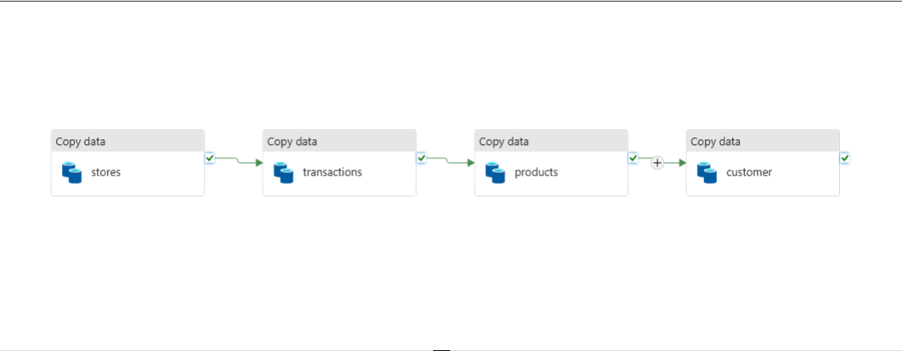
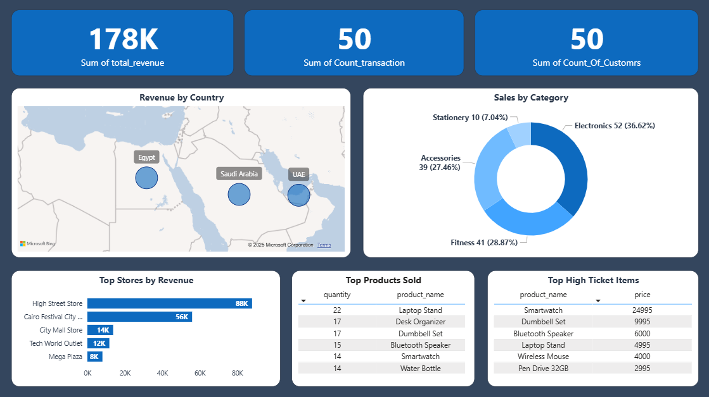

# Retail Data Engineering Pipeline (ADF • Databricks • Power BI)

## Overview
This project demonstrates an end-to-end retail data workflow built on Azure.  
Data is ingested from an operational source system into Azure Data Lake, processed using Databricks, structured for analytics, and finally visualized with Power BI.

The solution follows the **Bronze → Silver → Gold** data-layer paradigm to ensure scalable transformation and governance.

---

## Architecture

**Pipeline Flow**
1. Source system provides retail operational data.
2. Azure Data Factory ingests data into Azure Data Lake (Bronze).
3. Databricks notebooks clean, transform, and prepare Silver and Gold datasets.
4. Transformed data is modeled for analytics.
5. Power BI connects to curated data and visualizes retail KPIs.

---

## Technologies Used
- **Azure Data Factory** — data ingestion & orchestration  
- **Azure Data Lake Storage** — data storage (Bronze/Silver/Gold layers)  
- **Azure Databricks** — data transformation (Python / SQL)  
- **SQL** — product data schema & insertion
- **Power BI** — reporting & dashboarding  

---

## Data Flow Summary

### Bronze Layer
Raw, unprocessed data stored as received from source systems.

### Silver Layer
Processed, cleaned, validated, and normalized data.

### Gold Layer
Business-ready, aggregated data optimized for analytics and reporting.

---

## Components

### 1) Data Ingestion — Azure Data Factory
- Extracts retail data from source systems.
- Loads data to Azure Data Lake (Bronze layer).
- ARM templates included for reproducibility:
  - `ARMTemplateForFactory.json`
  - `ARMTemplateParametersForFactory.json`

---

### 2) Data Processing — Databricks
- Notebook: `data_processing.ipynb`
- Cleans, transforms, and aggregates data.
- Generates Silver and Gold datasets for downstream reporting.

---

### 3) Data Warehouse for the products / SQL
- SQL definition: `products.sql`
- Creates destination data structures:
  - Tables
  - Reporting views
  - Analytical models

---

### 4) Power BI Reporting
- Dashboard presents relevant retail KPIs and trends.
- Visuals (example):
    - Revenue analysis
    - Product performance
    - Category breakdown
    - Country-based trends

---

## Example KPIs
- Total revenue  
- Most sold products
- Sales by category
- Sales by region

---

## Improvements / Next Steps
- Automate Databricks workflows
- Add CI/CD deployment
- Implement data quality monitoring
- Enable incremental data loads
- Introduce star schema modeling

---

## Notes
- No sensitive data is included the project is based on fake data for practice purpose only.

---
